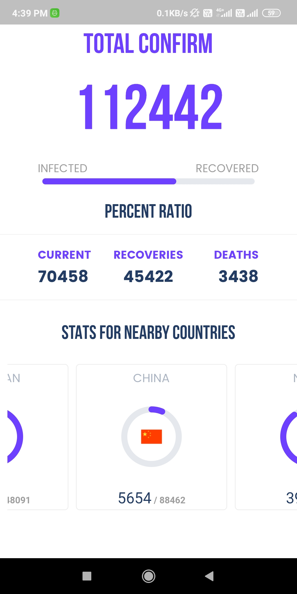
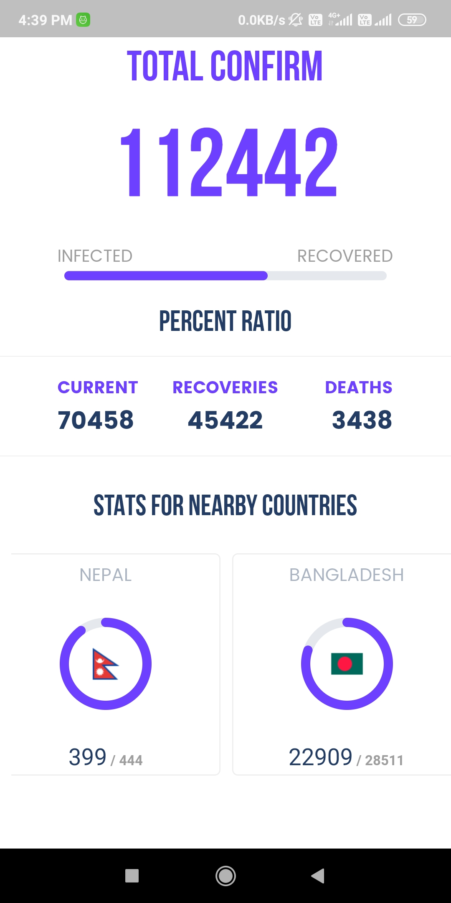

## CovidStat
<b>CovidStat</b> is a <b>Flutter</b> based app for staying updated regarding covid 19 statistics of India and countries around. I have used <b>Firestore</b> for database support which is constantly updated for providing latest satats around covid 19.<b>Please note : this app is still under development for better and more concerntric usability</b>
 
## Resources used 
- <b>Flutter</b>
- <b>Firebase</b>

## How it looks

# how to use
Download the <b>CovidStat.apk</b> file from the root directory
